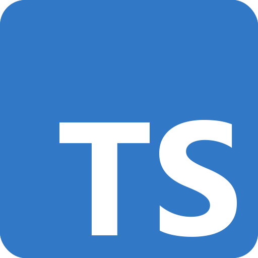

# Introduction

Or...**_Why This Project Exists_**

### Portability

In the modern software development landscape, the ability to deploy applications across various environments and
platforms is crucial. Developers often face challenges when trying to ensure that their applications run seamlessly on
different runtimes such as **Node.js**, **Deno**, **Bun**, **Cloudflare Workers**, **AWS Lambda** and more. Each of
these runtimes has its own set of features, performance characteristics, and limitations, making it difficult to write
code that is truly portable.

The expansion of serverless computing and the rise of edge computing have further highlighted the need for a unified
approach.

### Standardization

**Decorators** and **reflect metadata** are not yet part of the official **ECMAScript standard**, leading to inconsistencies in
their implementation across different runtimes. This lack of standardization can result in compatibility issues and
hinder the adoption of these features in production environments. This project aims to provide a consistent and reliable
way to use decorators across multiple JavaScript runtimes, ensuring that developers can leverage these powerful features
without worrying about compatibility issues.

We embraced the [latest (stage 3) TC39 proposals for decorators](https://github.com/tc39/proposal-decorators), following
[Deno's lead](https://decorators.deno.dev/) in adopting these features.

### Field Experience

Working alongside engineers using Angular and NestJS frameworks, we observed a common desire for a more
streamlined and efficient way to build server-side applications. Teams love the class-based API approach and the
decorator syntax, but often find themselves constrained by the limitations of their chosen runtime or framework.

## Philosophy

It can be simpler. It can be better. Why not?

## What Can You Do With It?

Any JavaScript application can be deployed using this project. Here are some examples:

- HTTP Server
- CLI Applications
- REST API
- Any TCP Server
- Cloud Functions
- WebSocket Server
- Cron Jobs
- And More...
